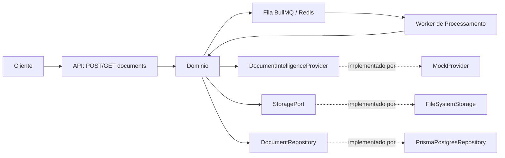
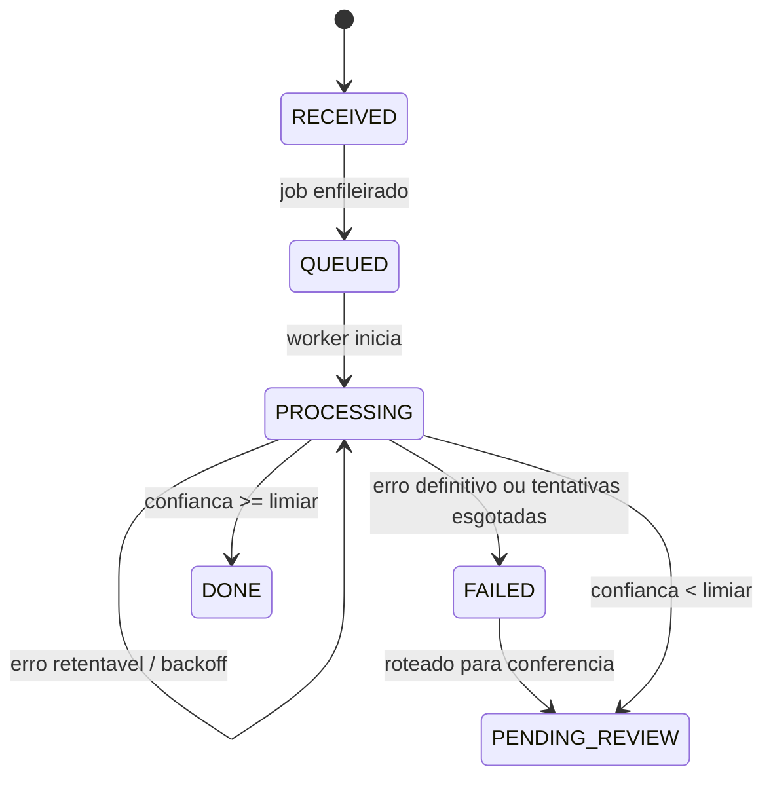
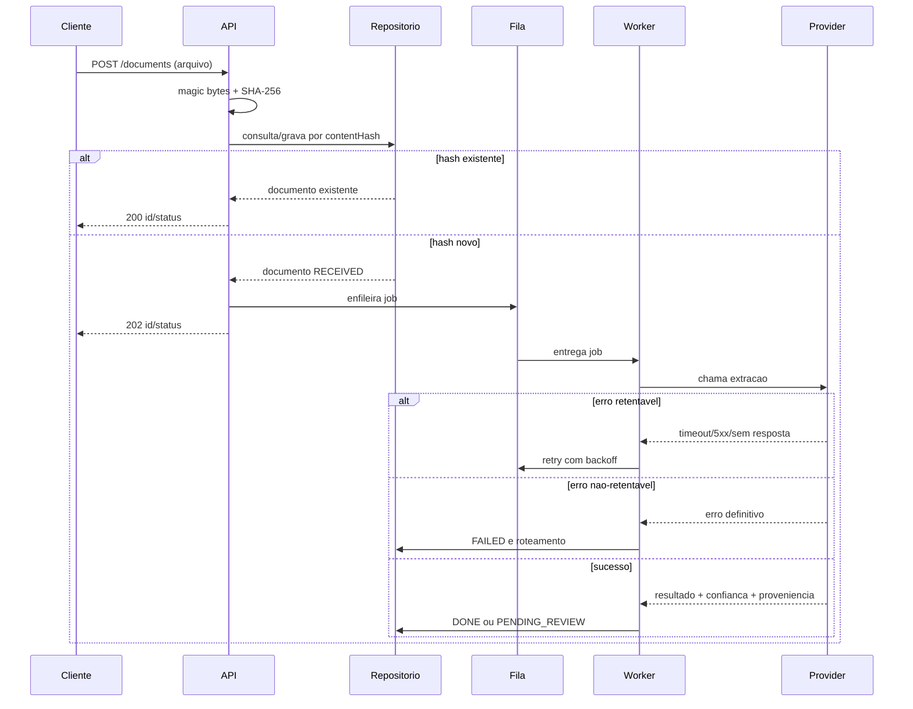

# DOC Intelligence - Documento de Especificacao Tecnica

**Documento:** SPEC-001  
**Modulo:** Ingestao e Processamento de Documentos (Trilha A - Back-end)  
**Versao:** 0.1.0  
**Status:** Rascunho para implementacao  
**Data original:** 30/08/2026

> **Proveniencia:** a versao 0.1.0 deste documento foi originalmente produzida e redigida antes da implementacao. Este commit representa sua incorporacao formal ao repositorio; a data original e o status de rascunho sao preservados.

## 1. Objetivo

Este documento especifica o comportamento, as restricoes e os criterios de aceitacao da fatia vertical do servico DOC Intelligence a ser implementada nesta entrega. Nao especifica o produto completo descrito no desafio original - apenas o subconjunto definido na Secao 2.

Convencoes de linguagem normativa usadas neste documento: **DEVE** indica requisito obrigatorio; **NAO DEVE** indica proibicao obrigatoria; **DEVERIA** indica recomendacao forte, com desvio permitido mediante justificativa registrada em ADR; **PODE** indica comportamento opcional.

## 2. Escopo

### 2.1 Escopo desta entrega

O sistema DEVE implementar o seguinte fluxo, de ponta a ponta:

| ID | Capacidade |
|---|---|
| CAP-01 | Receber um documento (imagem ou PDF) via API sincrona, com resposta imediata |
| CAP-02 | Validar o tipo real do arquivo, independentemente de metadados fornecidos pelo cliente |
| CAP-03 | Deduplicar documentos por conteudo, de forma segura sob concorrencia |
| CAP-04 | Processar o documento de forma assincrona, com resiliencia a falhas do provedor de extracao |
| CAP-05 | Registrar o resultado da extracao com proveniencia completa (modelo, prompt, parametros) |
| CAP-06 | Rotear o resultado por limiar de confianca, sem permitir que um resultado incerto seja tratado como definitivo |
| CAP-07 | Permitir consulta do status e do resultado de um documento, individualmente e em lista |

### 2.2 Fora de escopo desta entrega

| Item | Tratamento | Justificativa |
|---|---|---|
| Reivindicacao (claim) de documento para conferencia humana | Especificado em contrato (Secao 5.3), nao implementado | Pertence a fronteira com a interface do atendimento (Trilha B), fora do recorte escolhido |
| Consumo por sistemas internos de terceiros | Decisao de mecanismo registrada em ADR-004, nao implementado | Nao ha sistema consumidor real nesta fase; simular um consumidor ficticio nao agrega valor de engenharia |
| Autenticacao e autorizacao reais | Placeholder de API-key estatica, sinalizado como nao-produtivo | Fora do criterio de aceitacao da fatia vertical |
| Criptografia em repouso e politica de retencao/expurgo de dados pessoais | Registrado como risco conhecido (Secao 6) | Extrapola o tempo disponivel para a fatia vertical; tratado como debito tecnico explicito |
| Deploy em ambiente produtivo | Fora de escopo | Nao solicitado pelo desafio |

## 3. Premissas e Restricoes do Ambiente

| ID | Restricao | Requisitos derivados |
|---|---|---|
| ENV-A | O provedor de extracao e um modelo de linguagem multimodal de terceiro; latencia de 5-40s por chamada; sujeito a erro ou ausencia de resposta | RF-04, RF-05, RNF-01 |
| ENV-B | A origem do documento (aplicacao de atendimento) nao valida tipo, nome ou conteudo do arquivo antes do envio | RF-02 |
| ENV-C | O mesmo documento pode ser reenviado multiplas vezes pela mesma origem ou por origens distintas | RF-03 |
| ENV-D | O conteudo processado constitui dado pessoal, incluindo dado pessoal sensivel | RNF-04 |
| ENV-E | Volume medio de 150 documentos/dia, com picos superiores a 800, concentrados em janela de 2 horas | RNF-02 |
| ENV-F | O modelo e os prompts do provedor de extracao estao sujeitos a alteracao de versao ao longo do primeiro ano | RF-05, ADR-002 |
| ENV-G | Multiplos operadores podem tentar acessar a fila de conferencia concomitantemente | Especificado, nao implementado (Secao 2.2) |

## 4. Requisitos Funcionais

### RF-01 - Ingestao

O sistema DEVE expor um endpoint de ingestao que aceite um arquivo binario e retorne, de forma sincrona, um identificador do documento e seu status inicial, sem aguardar o processamento completo.

### RF-02 - Validacao de tipo

O sistema DEVE determinar o tipo real do arquivo por inspecao de conteudo (assinatura binaria), e NAO DEVE confiar em nome de arquivo, extensao ou Content-Type declarado pelo cliente para essa determinacao. Arquivos fora da whitelist de formatos suportados DEVEM ser rejeitados na ingestao, antes de qualquer enfileiramento.

### RF-03 - Deduplicacao

O sistema DEVE calcular um hash de conteudo (SHA-256) para cada documento recebido. Se um documento com hash identico ja existir, o sistema NAO DEVE reprocessa-lo, e DEVE retornar o identificador e status do documento ja existente. Esta verificacao DEVE ser segura sob concorrencia (duas ingestões simultaneas do mesmo conteudo NAO DEVEM resultar em duas chamadas ao provedor de extracao).

### RF-04 - Processamento assincrono e resiliencia

O processamento DEVE ocorrer de forma desacoplada da ingestao, via fila. Em caso de falha do provedor de extracao, o sistema DEVE distinguir falhas retentaveis (timeout, erro 5xx, ausencia de resposta) de falhas nao-retentaveis (erro de validacao de entrada, recusa do modelo), aplicando retentativa com espera exponencial apenas ao primeiro grupo. Um documento que esgote as retentativas NAO DEVE permanecer indefinidamente em estado de processamento; DEVE transicionar para um estado terminal de falha, roteavel para conferencia humana.

### RF-05 - Proveniencia do resultado

Todo resultado de extracao DEVE ser gravado junto com um registro imutavel da configuracao que o produziu (identificador do modelo, texto do prompt utilizado, parametros relevantes de inferencia).

### RF-06 - Roteamento por confianca

O sistema DEVE aplicar um limiar de confianca configuravel ao resultado da extracao. Resultados abaixo do limiar NAO DEVEM ser marcados como estado terminal de sucesso; DEVEM ser roteados a um estado de pendencia de revisao.

### RF-07 - Consulta

O sistema DEVE permitir a consulta do status e do resultado de um documento por identificador, e a listagem de documentos filtravel por status.

## 5. Requisitos Nao-Funcionais

### RNF-01 - Resiliencia a dependencia externa instavel

O sistema DEVE permanecer operacional (aceitando novas ingestões) mesmo quando o provedor de extracao estiver integralmente indisponivel.

### RNF-02 - Capacidade

A concorrencia do worker de processamento DEVE ser configuravel externamente (variavel de ambiente ou equivalente), sem exigir alteracao de codigo para ajuste sob pico de volume.

### RNF-03 - Modularidade e substituibilidade

A integracao com o provedor de extracao DEVE estar isolada do restante do dominio por uma interface (porta), de modo que a substituicao do provedor ou de sua versao nao exija alteracao em outras camadas do sistema.

### RNF-04 - Tratamento de dado sensivel

Nenhum registro de log estrutural DEVE conter, em texto plano, os campos extraidos de um documento.

### RNF-05 - Testabilidade

Os tres pontos de risco identificados nas premissas do ambiente (RF-03 sob concorrencia, RF-04 quanto a diferenciacao de erro, RF-06 quanto a nao-degradacao de resultado incerto) DEVEM possuir cobertura de teste automatizado. Cobertura ampla e nao-direcionada NAO E requisito desta entrega.

## 6. Riscos Conhecidos e Nao Mitigados

| ID | Risco | Motivo de nao mitigacao nesta entrega |
|---|---|---|
| RISK-01 | Dado pessoal sensivel armazenado sem criptografia em repouso | Fora do tempo disponivel para a fatia vertical; requer decisao de infraestrutura (gestao de chaves) nao trivial |
| RISK-02 | Ausencia de politica de retencao/expurgo de dados processados | Depende de definicao juridica (prazo de retencao) nao fornecida no desafio; pergunta enviada ao avaliador, sem resposta ate o momento da entrega |
| RISK-03 | Ausencia de mecanismo de claim/lease para concorrencia na fila de conferencia (ENV-G) | Pertence a Trilha B; contrato especificado, implementacao fora de escopo |
| RISK-04 | Deduplicacao (ADR-003) so detecta bytes identicos; quase-duplicatas (mesma foto tirada duas vezes, angulo/compressao diferentes) nao sao identificadas e sao processadas como documentos novos | Resolver com seguranca exige hash perceptual calibrado com dados reais, tratamento diferenciado para PDF e uma politica definida para falso positivo. Ver ADR-003 para a analise tecnica completa |

## 7. Rastreabilidade

A matriz completa de rastreamento entre fatos do ambiente (Secao 3), requisitos (Secoes 4-5) e decisoes de arquitetura sera mantida nos registros de decisao (ADR-001 a ADR-00N), referenciados individualmente a medida que forem redigidos.

## 8. Modelagem e Diagramas de Arquitetura

### 8.1 Diagrama de Componentes

O sistema e organizado em Cliente, Camada de Entrada (API), Dominio, Fila BullMQ/Redis, Worker de Processamento, Portas do Dominio e Adaptadores concretos. A API expoe `POST /documents`, `GET /documents/:id` e `GET /documents?status=`. O Dominio contem os servicos de ingestao e processamento e a politica de confianca. As portas sao `DocumentIntelligenceProvider`, `StoragePort` e `DocumentRepository`; os adaptadores sao `MockProvider`, `FileSystemStorage` e `PrismaPostgresRepository`.

### 8.2 Diagrama de Maquina de Estados

Estados: `RECEIVED`, `QUEUED`, `PROCESSING`, `FAILED`, `DONE` e `PENDING_REVIEW`. Um hash novo segue de `RECEIVED` para `QUEUED` e depois `PROCESSING`. Erro retentavel retorna a `PROCESSING` com backoff; erro nao-retentavel ou esgotamento segue a `FAILED` e e roteado para conferencia humana; sucesso de alta confianca segue a `DONE`; baixa confianca segue a `PENDING_REVIEW`.

### 8.3 Diagrama de Sequencia - Fluxo Principal

O cliente envia o arquivo; a API inspeciona magic bytes e calcula SHA-256; o repositorio verifica o hash e, se novo, grava `RECEIVED`; a fila recebe o job e a API responde `202`. O worker chama o provider, retenta erros temporarios com backoff, grava resultado e proveniencia, e aplica o limiar de confianca. Para hash existente, a API responde `200` sem novo job.

## 9. Registro de Decisoes de Arquitetura

As decisoes arquiteturalmente significativas que efetivamente moldam esta fatia vertical sao documentadas individualmente em `docs/adr/` e versionadas junto do codigo. Esta secao e o indice normativo:

| ID | Titulo | Status | Fatos/Requisitos relacionados |
|---|---|---|---|
| ADR-001 | Processamento assincrono via fila | Aceito | ENV-A, ENV-E, RF-01, RF-04, RNF-01, RNF-02 |
| ADR-002 | Arquitetura hexagonal (portas e adaptadores) | Aceito | ENV-F, RNF-03 |
| ADR-003 | Deduplicacao por hash de conteudo | Aceito | ENV-C, RF-03 |

- [ADR-001](adr/ADR-001.md)
- [ADR-002](adr/ADR-002.md)
- [ADR-003](adr/ADR-003.md)

Itens como o mecanismo de consumo por sistemas internos e a politica de retencao de dados pessoais sensiveis permanecem fora de escopo e como riscos conhecidos, conforme Secoes 2.2 e 6.
